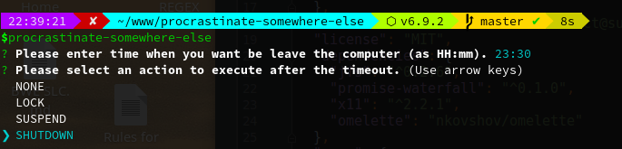

[](https://badge.fury.io/js/procrastinate-somewhere-else)

# procrastinate-somewhere-else
*Just a little longer... no more!*



A little program to help you leaving your computer via your own very personal message (e.g. "gtfo you lazy shit! <3"), shutting down or going to sleep mode. What's not to love?

### limitations
Only tested with the latest 3 major releases of ubuntu. No guarantee it runs anywhere else. Probably easy to improve this however if there is a demand. 

## install
```
npm i -g procrastinate-somewhere-else
```

## usage
```
procrastinate-somewhere-else
```

## pro tip
Add it as startup script with the following command.
```
gnome-terminal --command "node /home/[youruser]/[path-to/procrastinate-somewhere-else]/index.js" 
```

## advanced config
If needed (*no need really*) you can fiddle around with some pro settings in `[path-to-pse]/db.json`.